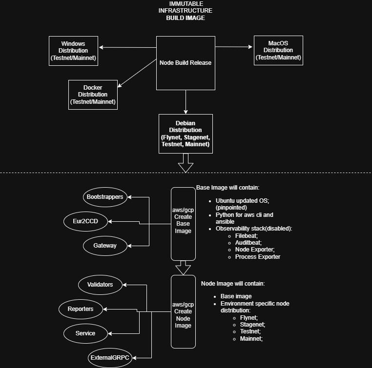

# Packer AMI/Image Builds

This directory contains [HashiCorp Packer](https://www.packer.io/) configurations for building machine images on AWS (AMI) and GCP. Both image types use Ubuntu 22.04 LTS as a base and support either cloud provider via a `cloud_provider` variable (`"aws"` or `"gcp"`).

## Images

### `observability/` — Base observability image

The base image that all Concordium node images are built on top of. Starts from a public Ubuntu 22.04 AMI (Canonical) on AWS, or `ubuntu-2204-lts` family on GCP.

**What gets installed:**

| Category | Packages / tools |
| --- | --- |
| APT | `jq`, `net-tools`, `nvme-cli`, `prometheus-node-exporter`, `python3-pip`, `software-properties-common`, `tree`, `libpam-google-authenticator`, `pkgconf` |
| Downloaded `.deb` | `process-exporter` v0.7.10, `promtail` v3.0.0 |
| Python (pip) | `awscli`, `boto3`, `openshift`, `PyMySQL`, `paramiko`, `stormssh`, `cryptography`, `pyopenssl`, `jmespath` |

Both `process-exporter` and `promtail` services are **disabled** at image build time (they are enabled/configured at instance launch by Ansible).

Also configures logrotate: sets rotation to daily, adds `maxsize 10G`, and installs a systemd timer override (`logrotate-timer-override.conf`). Disables `unattended-upgrades`.

On AWS, the AMI is copied to all regions listed in `target_aws_regions`.

### `concordium-node/` — Node image

Layered on top of the observability image. Installs a Concordium node `.deb` package into the image so instances can start without fetching the package at boot.

**What gets installed:**

- The Concordium node `.deb` (path provided via `concordium_node_path`) is copied into the instance and installed with `dpkg`.
- `debconf` selections are pre-set for the node collector name using `node_name_prefix` and `cloud_provider`.
- The `main.config.json` is removed post-install so environment-specific config is applied at runtime.

## Directory structure

```
packer/
├── Makefile                          # Convenience targets for stagenet test builds
├── concordium-node/
│   ├── main.pkr.hcl                  # Build definition (AWS + GCP sources)
│   ├── variables.pkr.hcl             # Variable declarations
│   └── variables.pkrvars.hcl.template  # Template for var files (copy and fill in)
└── observability/
    ├── main.pkr.hcl                  # Build definition (AWS + GCP sources)
    ├── variables.pkr.hcl             # Variable declarations
    ├── variables.pkrvars.hcl.template  # Template for var files (copy and fill in)
    └── logrotate-timer-override.conf # systemd timer override for logrotate
```

## Build



### CI/CD

The images are built using GitHub Actions. Both workflows run from `.github/workflows/` and require the `release-node-images` environment (which holds cloud credentials and shared variables). Shared variables (AWS regions, subnet mappings, service account names, `OBSERVABILITY_VERSION`) are stored in `.github/shared-variables/.env` and loaded at the start of each job.

#### `release-observability-images.yaml` — Build the base image

Triggered **manually** (`workflow_dispatch`, no inputs) Builds the observability base image for both `aws` and `gcp` in parallel.

**Jobs:**

1. **`get-observability-version`** — Reads `OBSERVABILITY_VERSION` from `.github/shared-variables/.env`, increments it by 1 (zero-padded to 5 digits), and outputs the new version for downstream jobs.

2. **`release-observability-image`** (matrix: `aws`, `gcp`) — For each cloud provider:
   - Authenticates with AWS (OIDC) or GCP (Workload Identity Federation).
   - Determines the image name: `concordium-observability-node-<version>-x86_64` (AWS) or `concordium-observability-node-<version>-x86-64` (GCP).
   - Skips the build if an image with that name already exists.
   - On AWS, looks up the subnet from the `REGION_TO_SUBNET` map and copies the AMI to all other environment regions (`TARGET_AWS_REGIONS`). The AMI is shared with the mainnet account (`727113945353`).
   - Runs `packer build -var-file=./variables.pkrvars.hcl observability/`.

3. **`remote-git-changes`** — After both builds succeed, uses a GitHub App token to commit the incremented `OBSERVABILITY_VERSION` back to `.github/shared-variables/.env`, then creates and pushes a git tag `observability/<version>`.

#### `release-node-images.yaml` — Build the node image

Is usually triggered by the Concordium node [release process](https://github.com/Concordium/concordium-node/blob/d50aaefbfb2bb8bb98f4646d28a2c6c68dd699c9/.github/workflows/release.yaml#L796), but can also be triggered **manually** (`workflow_dispatch`) with three inputs:

| Input | Required | Description |
| --- | --- | --- |
| `node_version` | Yes | Node `.deb` version, format `x.y.z-q` (e.g. `10.0.3-0`) |
| `release_type` | Yes | `alpha` or `rc` |
| `observability_version` | No | Pin a specific observability base image version; defaults to the value in `.env` |

**Jobs:**

1. **`generate-matrix`** — Builds the environment matrix dynamically based on `release_type`:
   - **`alpha`**: `stagenet` (AWS + GCP), `flynet` (AWS).
   - **`rc`** adds: `testnet` (AWS + GCP), `mainnet` (AWS + GCP). The mainnet AWS build also sets `ami_users` to share the AMI with the mainnet account (`727113945353`).

2. **`release-concordium-node-image`** (matrix from step 1) — For each `env`/`cloud_provider` combination:
   - Authenticates with AWS (OIDC, region from `ENVIRONMENT_TO_AWS_REGION` map) or GCP (Workload Identity).
   - Downloads the node `.deb` from S3: `s3://distribution.<env>.concordium.<tld>/deb/concordium-<env>-node_<version>_amd64.deb`.
   - Constructs the image name: `<env>-<node_version>-concordium-node-<observability_version>-x86_64` (AWS) or `<env>-v<node_version_dashes>-concordium-node-<observability_version>-x86-64` (GCP).
   - Skips the build if an image with that name already exists.
   - Looks up the source observability image by name and passes it as `source_ami_id`.
   - Runs `packer build -var-file=./variables.pkrvars.hcl concordium-node/`.

3. **`remote-git-changes`** — After all matrix builds succeed, creates and pushes a git tag `node/<node_version>`.


### Manual build instructions

#### Build order

The images must be built in order — `concordium-node` uses the observability image as its source:

1. Build `observability/` → produces an AMI/image ID
2. Pass that image ID as `source_ami_id` when building `concordium-node/`

#### Prerequisites

- [Packer](https://developer.hashicorp.com/packer/install) installed
- AWS credentials configured (SSO or static) with permissions to create AMIs
- For GCP: `GOOGLE_APPLICATION_CREDENTIALS` set to a valid service account key file

#### Initialize plugins

```shell
packer init observability/
packer init concordium-node/
```

#### Creating a var file

Copy the template and fill in values:

```shell
cp observability/variables.pkrvars.hcl.template observability/my.pkrvars.hcl
# edit my.pkrvars.hcl
```

Key variables for `observability/`:

| Variable | Description |
| --- | --- |
| `cloud_provider` | `"aws"` or `"gcp"` |
| `ami_name` | Name for the output image |
| `aws_region` | Source/build region (default: `eu-west-1`) |
| `target_aws_regions` | List of regions to copy the AMI to (AWS only) |
| `subnet_id` | Subnet to launch the build instance in (AWS only) |
| `ami_users` | List of AWS account IDs to share the AMI with |
| `gcp_zone` | GCP zone (default: `europe-west1-b`) |

Key variables for `concordium-node/` (in addition to the above):

| Variable | Description |
| --- | --- |
| `source_ami_id` | ID of the observability image to layer on top of |
| `environment` | Concordium environment (`stagenet`, `testnet`, `mainnet`) |
| `concordium_node_path` | Local path to the `.deb` package to bake in |
| `node_name_prefix` | Prefix for the node collector name |

#### Manual build

```shell
# Build observability image
packer build -var-file=observability/my.pkrvars.hcl observability/

# Build node image (use the AMI ID output by the previous step as source_ami_id)
packer build -var-file=concordium-node/my.pkrvars.hcl concordium-node/
```

### Stagenet test build via Makefile

The `Makefile` provides a shortcut for running a full test build against stagenet. It downloads the node `.deb` from S3, builds the observability image, extracts the resulting AMI ID from `build.log`, and feeds it into the node build:

```shell
# Override NODE_VERSION if needed (default: 10.0.3-0)
make NODE_VERSION=10.0.4-0

# Or run steps individually
make download-ami
make build-observability
make build-node
```

`build.log` is written by the observability step and read by the node step to extract the `eu-west-1` AMI ID. It is `.gitignore`d.
